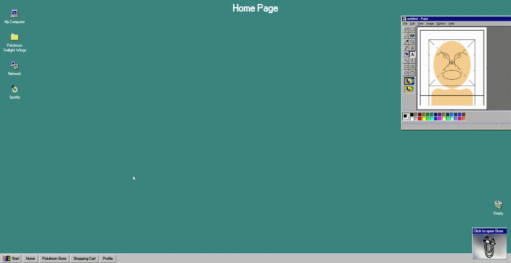

<h1 align="center">Pokémon Online Store</h1>

<p align="center">
    <a href="https://github.com/kulinichevgeny/pokemon-online-store/graphs/contributors" alt="Contributors">
        </a>
    <a href="#" alt="Activity">
        </a>
    <a href="#" alt="Last commit">
        </a>
    <a href="https://github.com/kulinichevgeny/pokemon-online-store/blob/master/LICENSE" alt="License">
        </a>
    <a href="#" alt="License">
        </a>
</p>


<p align=center>
    
</p>

## About
Pokémon Online Store app is my IT SHATLE React module graduation work. Desktop version looks amazing, but there are no Mobile version yet.
Made with HTML, Sass(SCSS), JavaScript, React, Redux, Material-UI & Inspiration from Windows 95.
You can check out the project [Technical Requirement](https://github.com/kulinichevgeny/pokemon-online-store/blob/master/public/technicalrequirement.md).
You are welcome!

## Preview
While using this app press `F11` key to enable Browser Full Screen Mode for a better User Experience ✨

<p align=center>
    
</p>

## Installation
1. Clone this repository or download zip
```bash
git clone https://github.com/kulinichevgeny/pokemon-online-store
```

2. Install dependencies
```bash
npm install
```

3. Run the development server
```bash
npm start
```

## Contributing
- Fork it ( https://github.com/kulinichevgeny/pokemon-online-store/fork )
- Create your feature branch (`git checkout -b my-killer-feature`)
- Commit your changes (`git commit -am 'Add killer feature`)
- Push to the branch (`git push origin my-killer-feature`)
- Create a new Pull Request

## Questions?
Have a bug or an issue with this project? [Open a new issue](https://github.com/kulinichevgeny/pokemon-online-store/issues/new) here on GitHub

## License
Pokémon Online Store is under MIT License

## Developer
Pokémon Online Store is created by [Zhenya Kulinich](https://github.com/kulinichevgeny)